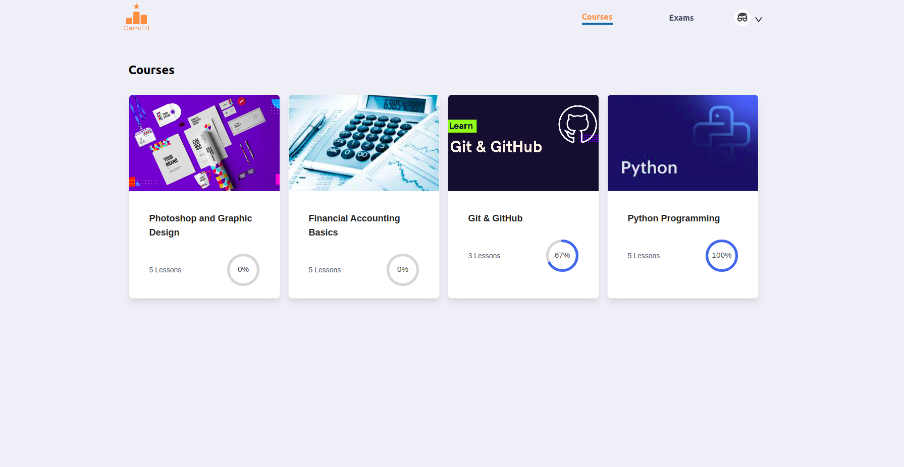
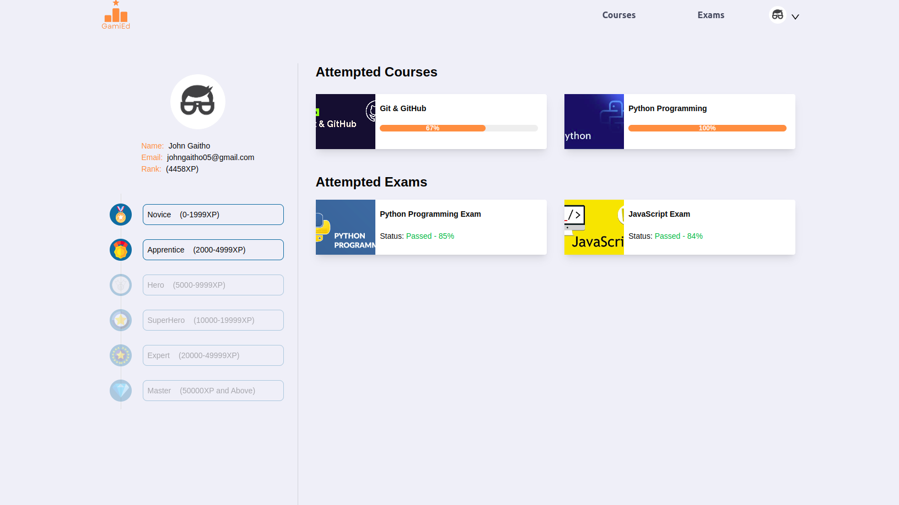
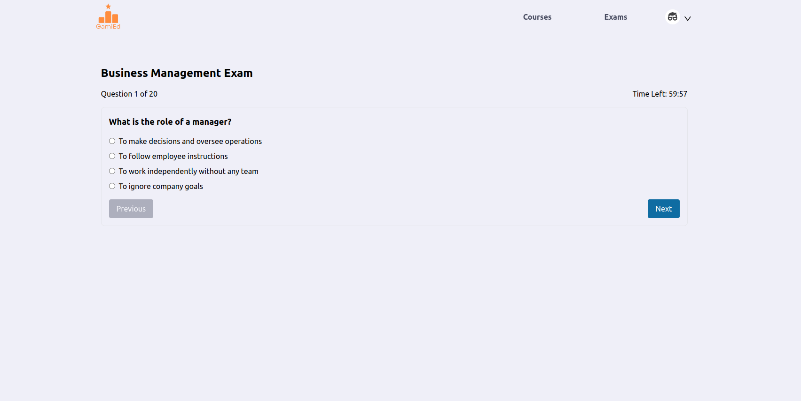

# GamiEd
GamiEd a gamified e-learning platform meant to administer short courses to employees in an organization.Courses are organized in Lessons and Each lesson has a Quiz section that earns points to the user. The points earned are used to promote the user using a predefined levels scheme.

The application is built with React JS

### Live Demo
- Hosted on: [https://gamied.com](https://gamied.tech)
- Backend Hosted on: ([https://api.gamied.com](https://api.gamied.com)

### Installation
```
npm install
npm run dev
```







